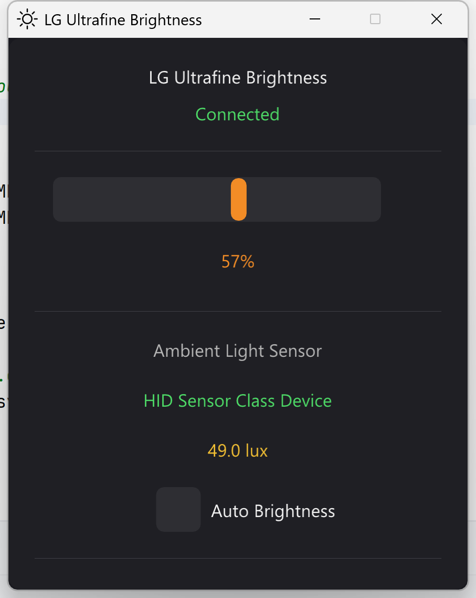

# LG Ultrafine Brightness Control

A sleek Windows application for controlling LG Ultrafine 4K/5K monitor brightness with a beautiful modern UI and intelligent auto-brightness.

## ✨ Features

- 🌟 **Auto-Brightness** - Automatically adjusts screen brightness based on ambient light sensor (ALS) built into your LG Ultrafine display
- 🎨 **Beautiful Modern UI** - Dark-themed interface built with ImGui and DirectX 11
- 🖥️ **Native Brightness Control** - Direct HID communication with LG Ultrafine monitors
- ⌨️ **Global Hotkeys** - Adjust brightness from anywhere using Ctrl+Alt+Up/Down
- 🎯 **System Tray Integration** - Minimal footprint with quick access from tray icon

## 📸 Screenshots



## 🔧 Supported Monitors

- LG Ultrafine 5K Display (27MD5KL-B, 27MD5KA-B)
- LG Ultrafine 4K Display (24MD4KL-B, 22MD4KA-B)

## 🎮 Usage

### Auto-Brightness

If your LG Ultrafine monitor has a built-in ambient light sensor (ALS), the app will automatically detect it and enable auto-brightness features:

1. **View Real-time Ambient Light** - The UI displays the current ambient light level in lux
2. **Enable Auto-Brightness** - Check the "Auto Brightness" checkbox to let the app automatically adjust brightness based on room lighting
3. **Smart Algorithm** - The app intelligently maps ambient light levels to optimal brightness:
   - 0-50 lux (very dark) → 10-20% brightness
   - 50-200 lux (dim indoor) → 20-40% brightness
   - 200-500 lux (normal indoor) → 40-70% brightness
   - 500-1000 lux (bright indoor) → 70-90% brightness
   - 1000+ lux (very bright/outdoor) → 90-100% brightness

> **Note**: If no ALS is detected, the UI will show "Not Supported" and you can still manually control brightness.

### Manual Brightness Control

- **Slider**: Drag the slider in the main window
- **Hotkeys**:
  - `Ctrl + Alt + Up` - Increase brightness by 5%
  - `Ctrl + Alt + Down` - Decrease brightness by 5%

> **Tip**: When auto-brightness is enabled, the manual slider is disabled. Uncheck "Auto Brightness" to regain manual __control.

## 🛠️ Building from Source

### Prerequisites

- Windows 10/11
- Visual Studio 2019 or later (with C++ desktop development)
- CMake 3.20+
- Git
- Ninja

### Build Steps

```bash
# Clone the repository
git clone https://github.com/yourusername/lg-ultrafine-brightness.git
cd lg-ultrafine-brightness

# Initialize submodules
git submodule update --init --recursive

# Configure (from Visual Studio Developer Command Prompt)
mkdir build
cd build

cmake ..

cmake --build . --config Release

```